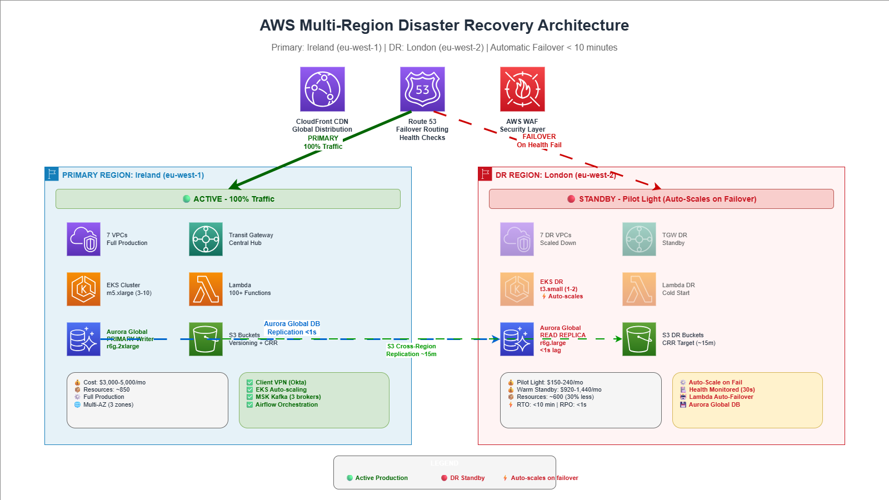

# 🏗️ AWS Enterprise Edition EKS Application with DR Region

## 🚀 Multi-Region Enterprise-Grade AWS Architecture with Disaster Recovery

This repository contains a complete **AWS enterprise architecture** with **EKS (Elastic Kubernetes Service)**, implementing a **multi-region disaster recovery** strategy between **Ireland (eu-west-1)** and **London (eu-west-2)** regions.

[](https://aws.amazon.com/)
[](https://www.terraform.io/)
[](https://kubernetes.io/)
[](LICENSE)

---

## 📋 Table of Contents

- [Architecture Overview](#-architecture-overview)
- [Key Features](#-key-features)
- [Architecture Diagrams](#-architecture-diagrams)
- [Repository Structure](#-repository-structure)
- [Environment Branches](#-environment-branches)
- [Getting Started](#-getting-started)
- [Deployment Guide](#-deployment-guide)
- [Disaster Recovery](#-disaster-recovery)
- [Security](#-security)
- [Monitoring & Observability](#-monitoring--observability)
- [Cost Optimization](#-cost-optimization)
- [Well-Architected Alignment](#-well-architected-alignment)
- [Contributing](#-contributing)

---

## 🏛️ Architecture Overview

This solution implements a **hub-and-spoke VPC architecture** with multiple specialized VPCs connected through **AWS Transit Gateway**, providing:

- **Multi-Region Architecture**: Primary (Ireland) + DR (London)
- **Zero-Trust Security**: Network segmentation with AWS Network Firewall
- **High Availability**: Multi-AZ deployment across 3 availability zones
- **Auto-Scaling**: EKS node groups with HPA and Karpenter
- **Data Platform**: Aurora, Redshift, MSK Kafka, OpenSearch
- **Edge Security**: CloudFront + WAF + API Gateway
- **Automated DR**: Lambda-based failover automation

---

## ✨ Key Features

### 🔐 **Security First**
- ✅ AWS Network Firewall for traffic inspection
- ✅ WAF with OWASP Top 10 protection
- ✅ Private subnets for all workloads
- ✅ Secrets Manager for credential management
- ✅ VPC Flow Logs and GuardDuty integration
- ✅ KMS encryption for data at rest

### 🌐 **Networking**
- ✅ Hub-and-spoke architecture with Transit Gateway
- ✅ 6 specialized VPCs (Hub, Ingress, Inspection, Workload, Data, Private Ingress)
- ✅ VPC Endpoints for AWS services (S3, DynamoDB, ECR, EKS)
- ✅ Route 53 for DNS with health checks and failover
- ✅ AWS PrivateLink for secure service access

### ☸️ **Container Orchestration**
- ✅ EKS 1.31+ with managed node groups
- ✅ Karpenter for efficient auto-scaling
- ✅ Application Load Balancer (ALB) for ingress
- ✅ Helm charts for application deployment
- ✅ Container Insights for monitoring

### 💾 **Data Platform**
- ✅ Aurora PostgreSQL with cross-region replication
- ✅ Amazon Redshift for data warehousing
- ✅ MSK (Kafka) for event streaming
- ✅ OpenSearch for logging and analytics
- ✅ S3 with lifecycle policies and replication

### 🔄 **Disaster Recovery**
- ✅ Active-Passive DR strategy (RPO: 5 min, RTO: 15 min)
- ✅ Automated failover with Lambda functions
- ✅ Cross-region replication for all data stores
- ✅ Route 53 health checks and failover routing
- ✅ Regular DR testing automation

### 📊 **Observability**
- ✅ CloudWatch dashboards and alarms
- ✅ X-Ray distributed tracing
- ✅ SNS notifications for critical events
- ✅ Custom metrics and logging
- ✅ Cost monitoring and optimization

---

## 📐 Architecture Diagrams

### 1. Multi-Region Overview


Shows the complete architecture spanning Ireland (Primary) and London (DR) regions.

### 2. Primary Region (Ireland)
See: [`diagrams/2-primary-ireland-v2.drawio`](diagrams/2-primary-ireland-v2.drawio)

Detailed view of the primary Ireland deployment with all VPCs, EKS clusters, and data services.

### 3. DR Region (London)
See: [`diagrams/3-dr-london-v2.drawio`](diagrams/3-dr-london-v2.drawio)

Complete DR region architecture with standby resources and replication setup.

> **📝 Note**: Diagrams can be opened in [draw.io](https://app.diagrams.net/) for editing.

---

## 📁 Repository Structure

```
aws-enterprise-eks-architecture/
│
├── 📂 diagrams/                      # Architecture diagrams
│   ├── 1-multi-region-overview.drawio
│   ├── 2-primary-ireland-v2.drawio   # ✅ Fixed icons & text
│   ├── 3-dr-london-v2.drawio         # ✅ Fixed icons & text
│   └── README.md
│
├── 📂 docs/                          # Complete documentation
│   ├── Components.md
│   ├── DISASTER-RECOVERY.md
│   ├── DR-DEPLOYMENT-GUIDE.md
│   ├── Network Architecture.md
│   ├── Security Architecture.md
│   └── WORKSPACE-GUIDE.md
│
├── 📂 Modules/                       # Terraform modules
│   ├── cloudfront-waf/
│   ├── data-vpc/
│   ├── eks/
│   ├── hub-vpc/
│   ├── ingress-vpc/
│   ├── inspection-vpc/
│   ├── networking-dns/
│   ├── private-ingress-vpc/
│   ├── security/
│   ├── shared-services/
│   ├── transit-gateway/
│   └── workload-vpc/
│
├── 📂 lambda/                        # DR automation
│   └── dr-scale-up.py
│
├── 📄 main.tf                        # Root Terraform config
├── 📄 dr-infrastructure.tf           # DR-specific resources
├── 📄 providers.tf                   # AWS provider config
├── 📄 variables.tf                   # Variable definitions
├── 📄 outputs.tf                     # Output definitions
│
├── 📄 dev.tfvars                     # Dev environment
├── 📄 poc.tfvars                     # POC environment
├── 📄 staging.tfvars                 # Staging environment
├── 📄 prod.tfvars                    # Production environment
│
├── 📄 workspace-manager.ps1          # Workspace management
├── 📄 package-dr-lambda.ps1          # Lambda packaging
├── 📄 push-to-github.ps1             # Git push helper
│
└── 📄 README.md                      # This file
```

---

## 🌿 Environment Branches

This repository uses **branch-based environment management**:

| Branch | Purpose | Region | Environment |
|--------|---------|--------|-------------|
| **`main`** | Production (stable, production-ready) | eu-west-1 | Production (Ireland) |
| **`staging`** | Pre-production testing | eu-west-1 | Staging |
| **`poc`** | Proof of Concept (experimental) | eu-west-1 | POC |
| **`dev`** | Active development | eu-west-1 | Development |
| **`dr-london`** | Disaster Recovery (passive standby) | eu-west-2 | DR (London) |

### Deployment Flow:
```
dev → poc → staging → main (Production)
                        ↓
                  dr-london (auto-sync)
```

> 📘 **See [`BRANCH-STRATEGY.md`](BRANCH-STRATEGY.md) for complete branch management guidelines**

---

## 🚀 Getting Started

### Prerequisites

- **AWS Account** with appropriate permissions
- **Terraform** v1.5+ installed ([Download](https://www.terraform.io/downloads))
- **AWS CLI** v2+ configured ([Installation Guide](https://aws.amazon.com/cli/))
- **kubectl** for Kubernetes management ([Install](https://kubernetes.io/docs/tasks/tools/))
- **Helm** v3+ for chart deployment ([Install](https://helm.sh/docs/intro/install/))

### Initial Setup

1. **Clone the repository**:
```bash
git clone https://github.com/jimmy622001/AWS-Enterprise-Edition-EKS-Application-with-DR-Region.git
cd AWS-Enterprise-Edition-EKS-Application-with-DR-Region
```

2. **Configure AWS credentials**:
```bash
aws configure
```

3. **Initialize Terraform**:
```bash
terraform init
```

4. **Select workspace** (for environment isolation):
```bash
# For development
terraform workspace new dev
terraform workspace select dev

# For production
terraform workspace new prod
terraform workspace select prod
```

---

## 📦 Deployment Guide

### Development Environment

```bash
# Switch to dev branch
git checkout dev

# Select dev workspace
terraform workspace select dev

# Plan deployment
terraform plan -var-file="dev.tfvars" -out=tfplan

# Apply changes
terraform apply tfplan
```

### Production Environment

```bash
# Switch to prod branch
git checkout prod

# Select prod workspace
terraform workspace select prod

# Plan deployment
terraform plan -var-file="prod.tfvars" -out=tfplan

# Review and apply
terraform apply tfplan
```

### DR Environment

```bash
# Switch to DR branch
git checkout dr-london

# Deploy DR infrastructure
terraform plan -var-file="prod.tfvars" -var="is_dr_region=true" -out=tfplan
terraform apply tfplan
```

> **⚠️ Important**: Always review the plan before applying in production!

---

## 🔄 Disaster Recovery

### DR Strategy
- **RPO (Recovery Point Objective)**: 5 minutes
- **RTO (Recovery Time Objective)**: 15 minutes
- **Strategy**: Active-Passive (Ireland Primary → London DR)

### Automated Failover Process

1. **Health Check Failure** → Route 53 detects outage
2. **DNS Failover** → Traffic redirected to DR region
3. **Lambda Trigger** → Automated scale-up initiated
4. **Database Promotion** → Aurora read replica promoted to primary
5. **Service Activation** → EKS scaled to handle traffic
6. **Verification** → Health checks confirm DR is operational

### Manual Failover

```bash
# 1. Verify DR readiness
./scripts/verify-dr-readiness.sh

# 2. Initiate failover
./scripts/initiate-failover.sh

# 3. Monitor failover progress
./scripts/monitor-failover.sh
```

### Failback Process

```bash
# After primary region recovery
./scripts/initiate-failback.sh
```

For complete DR documentation, see: [`docs/DISASTER-RECOVERY.md`](docs/DISASTER-RECOVERY.md)

---

## 🔐 Security

### Security Layers

1. **Edge Security**
   - CloudFront with geo-blocking
   - AWS WAF with managed rule sets
   - DDoS protection with Shield Standard

2. **Network Security**
   - AWS Network Firewall for deep packet inspection
   - Security groups with least privilege
   - NACLs for subnet-level control
   - VPC Flow Logs enabled

3. **Application Security**
   - API Gateway with throttling
   - JWT/OAuth authentication
   - Input validation and sanitization
   - Rate limiting

4. **Data Security**
   - KMS encryption at rest
   - TLS 1.2+ in transit
   - Secrets Manager for credentials
   - RDS IAM authentication

5. **Compliance**
   - AWS Config for compliance monitoring
   - CloudTrail for audit logging
   - GuardDuty for threat detection
   - Security Hub for centralized view

---

## 📊 Monitoring & Observability

### CloudWatch Dashboards
- Infrastructure metrics
- Application performance
- Database performance
- Cost tracking

### Alerts & Notifications
- SNS topics for critical alerts
- PagerDuty integration (optional)
- Email notifications
- Slack webhooks (optional)

### Logging
- CloudWatch Logs for centralized logging
- OpenSearch for log analytics
- VPC Flow Logs for network monitoring
- X-Ray for distributed tracing

---

## 💰 Cost Optimization

### Implemented Strategies
- ✅ Spot instances for non-critical workloads
- ✅ Auto-scaling with Karpenter
- ✅ S3 Intelligent-Tiering
- ✅ Aurora Serverless v2 for dev/UAT
- ✅ DR region with minimal resources (scaled on-demand)
- ✅ Reserved Instances for stable workloads

### Estimated Monthly Costs

| Environment | Estimated Cost |
|-------------|----------------|
| Development | $500-800 |
| UAT | $600-900 |
| Staging | $800-1,200 |
| Production | $3,000-5,000 |
| DR (Standby) | $800-1,200 |

> **Note**: Costs vary based on traffic, data storage, and usage patterns.

---

## 🧪 Testing

### Infrastructure Testing
```bash
# Terraform validation
terraform validate

# Format check
terraform fmt -check

# Security scan with tfsec
tfsec .

# Cost estimation with Infracost
infracost breakdown --path .
```

### DR Testing
```bash
# Monthly DR drill
./scripts/dr-drill.sh

# Verify replication status
./scripts/check-replication.sh
```

---

## 🤝 Contributing

Contributions are welcome! Please follow these guidelines:

1. Fork the repository
2. Create a feature branch (`git checkout -b feature/amazing-feature`)
3. Commit your changes (`git commit -m 'feat: add amazing feature'`)
4. Push to the branch (`git push origin feature/amazing-feature`)
5. Open a Pull Request

### Commit Convention
We follow [Conventional Commits](https://www.conventionalcommits.org/):
- `feat:` New features
- `fix:` Bug fixes
- `docs:` Documentation changes
- `chore:` Maintenance tasks
- `refactor:` Code refactoring

---

## 📄 License

This project is licensed under the MIT License - see the [LICENSE](LICENSE) file for details.

---

## 🙏 Acknowledgments

- AWS Architecture Best Practices
- Terraform AWS Modules Community
- EKS Best Practices Guide
- AWS Well-Architected Framework

---

## 📞 Support

For questions, issues, or contributions:
- **Issues**: [GitHub Issues](https://github.com/jimmy622001/AWS-Enterprise-Edition-EKS-Application-with-DR-Region/issues)
- **Discussions**: [GitHub Discussions](https://github.com/jimmy622001/AWS-Enterprise-Edition-EKS-Application-with-DR-Region/discussions)
- **Email**: jimmy622001@users.noreply.github.com

---

## 🗺️ Roadmap

- [ ] Add Terraform Cloud integration
- [ ] Implement GitOps with ArgoCD
- [ ] Add service mesh (Istio/Linkerd)
- [ ] Enhanced observability with Grafana
- [ ] Cost optimization automation
- [ ] Multi-cloud abstraction layer

---

**⭐ If you find this project helpful, please consider giving it a star!**

---

*Last Updated: 2025*
